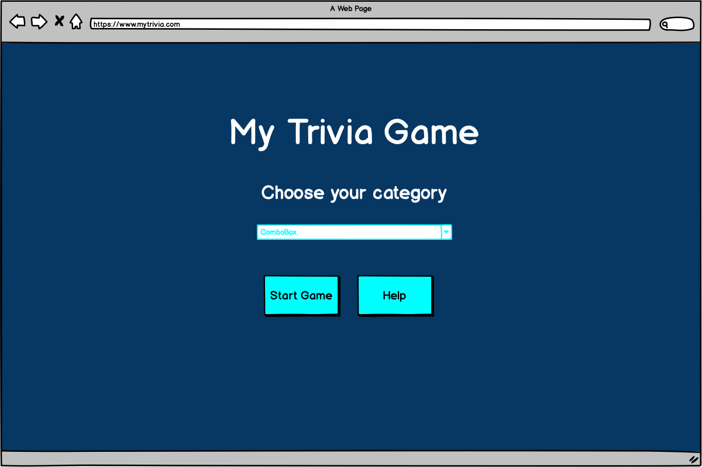
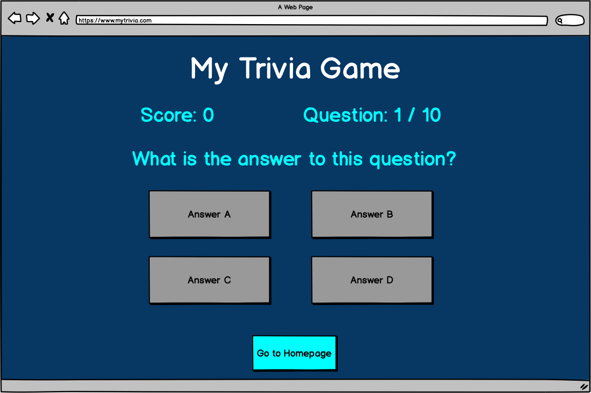
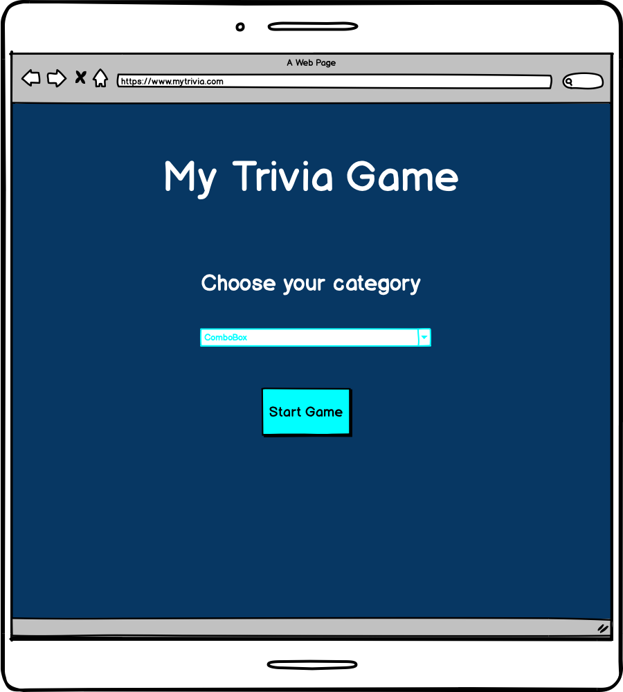
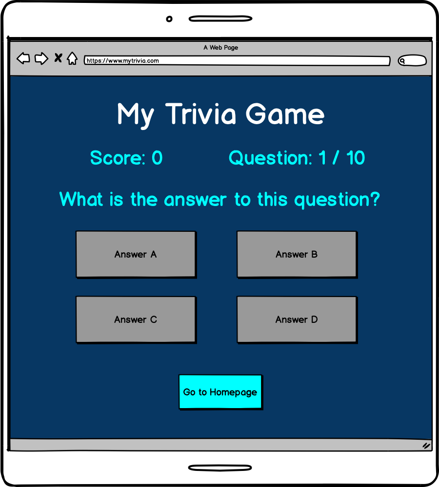

# **Brain Quizzers**

## **Goal for this project** 

Welcome to Brain Quizzers! 

Are you looking to test your general knowledge about entertainment, science, sports and so on? 
Then you are in the perfect place! Get started and you might still even learn a thing or two!

Thank you for visiting my project!
If you have any feedback or questions, head over to my GitHub contact details and feel free to reach out to me.

---

## Table of contents 
* [UX](#ux)
    * [User Goals](#user-goals)
    * [User Stories](#user-stories)
    * [Site Owners Goals](#site-owners-goals)
    * [User Requirements and Expectations](#user-requirements-and-expectations)
        * [Requirements](#requirements)
        * [Expectations](#expectations)
    * [Design Choices](#design-choices)
        * [Fonts](#fonts)
        * [Icons](#icons)
        * [Colors](#colors)
        * [Structure](#structure)
* [Wireframes](#wireframes)
* [Features](#features)
    * [Existing Features](#existing-features)
    * [Features to be implemented](#features-to-be-implemented)
* [Technologies used](#technologies-used)
    * [Languages](#languages)
    * [Tools and Libraries](#tools-and-libraries)
* [Testing](#testing)
* [Deployment](#deployment)
* [Credits](#credits)

## **UX**

### **User Goals**

* The games has to be responsive on various devices like tablets, phones and desktops
* The option to choose the category the user would like to play
* Feedback when wrong answer was chosen
* Visually appealing website 
* During the game to track your score and how many questions are left in the game. 

[Back to Top](#table-of-contents)

### **User Stories**

* As a user, I would like to be able to pick a category
* As a user, I would like to track my score during the game. 
* As a user, I expect a variey of questions so no questions get repeated.
* As a user, I would like to know the correct answer when answered incorrectly.
* As a user, I expect that the game has a nice visually appealing lay out to be in line with the game.
* As a user of a game, the first impression is very important. 
* As a user you already want to get the happy feeling as of the moment you open the website.
* As a user, I expect all the different pages to be in the same style to make it as a whole.
* As a user I want to learn something new while playing a game. 
* As a user, I want the webiste to be easy to use. I prefer not to have too many buttons or options. 

### **Site owners Goals**
* To have an appealing website where users want to go to play Trivia
* For the users to learn something when playing my game

[Back to Top](#table-of-contents)

### **User Requirements and Expectations**

#### Requirements
* Easy to navigate by using the few buttons
* Appealing homepage
* Easy way to pick your category and start the game
* Validate the correct answer
* Keep the score of the user playing

#### Expectations
* When a certain category is chosen, that the correct questions appear
* Feedback to the users where in the game they are and total amount of questions
* To let the user know if their answer was correct or false
* Show correct answer when answered incorrectly
* To show the final result after playing
* Show a personalised message after completing the game

[Back to Top](#table-of-contents)

### **Design Choices**

I have used [Coolors](https://coolors.co/ "Coolors.co") to come up with a color scheme that matches the atmosphere of a playful Trivia Game.
For this website I have deciced to keep design simple but playful in order to not take the attention away from the game.

#### Fonts
In order to find appropriate fonts for my website, I have visited [Google Fonts](https://fonts.google.com/ "Google Fonts") to explore the various options.
For the title of my game, I have used the font [Kalam](https://fonts.google.com/specimen/Kalam?query=kalam "Kalam") 
and for the main text I have used [Playfair Display](https://fonts.google.com/specimen/Playfair+Display?query=playfair "Playfair Display"). 
The title is a handwritten fonts that give a more personal and playful feeling.

#### Icons
I will use some icons for the buttons but I will make sure that the icons are self-explanatory so it doesn't confuse the user.

#### Colors

Like I mentioned before, I have decided to use some colors that fit well with the feeling of a game.
Below I will explain more why I choose the various colors and for what I will be using them.

* #54455F: This purple color I will use as a background for all the different pages on the website. 
* #7C3C4A: This pink / red color I will use to highlight the buttons on the page. 
* #FCF3EE: This will be my text color for the overall website.

I have used to contract checker on Coolors in order to make sure that the contract is sufficient.
This way my content will be easily readable. 

#### Structure
I have chosen to use [Bootstrap](https://getbootstrap.com/) to create an overall structure for my website. 
Bootstrap provides various elements of CSS and Javascript which is very helpful to keep a good structure on your page. 
As Bootstrap is designed for mobile first, I will be certain that my website functions well on mobile.

[Back to Top](#table-of-contents)

--- 

## **Wireframes**
I have decided to use [Balsamic](https://balsamiq.com/wireframes/) to create wireframes for my website. 
First I created a basic wireframe for desktop and later on for tablet and mobile. 

You can find my wireframes below:

### Desktop Wireframe: Homepage

### Desktop Wireframe: Game

### Tablet Wireframe: Homepage

### Tablet Wireframe: Game

### Mobile Wireframe: Homepage

### Mobile Wireframe: Homepage

[Back to Top](#table-of-contents)

---

## **Features**

### **Existing Features**

* Use of [open Trivia API](https://opentdb.com/) 
* Ability to choose preferred category
* Validation of answers
* Feedback when answer was incorrectly
* Tracker for questions and score
* Personalised message after finishing game depending on final score

### **Features to be implemented**

* Ability to register high score to compare with others
* Field to insert name so the message are more personalised
* Add timer of 10 seconds per question
* Add background images depending on category chosen to make the game more visually appealing
* Implement chose of difficulty and amount fo questions to target broader audience

[Back to Top](#table-of-contents)

## **Technologies used**

### **Languages**

* [HTML](https://en.wikipedia.org/wiki/HTML)
* [CSS](https://en.wikipedia.org/wiki/Cascading_Style_Sheets)
* [JavaScript](https://en.wikipedia.org/wiki/JavaScript)

### **Tools and Libraries**

* [Font Awesome](https://fontawesome.com/)
* [Bootstrap](https://getbootstrap.com/)
* [Google Fonts](https://fonts.google.com/)
* [GitHub](https://github.com/)
* [Balsamic](https://balsamiq.com/wireframes/)
* [W3C HTML Validation Service](https://validator.w3.org/)
* [W3C CSS Validation Service](https://jigsaw.w3.org/css-validator/)
* [techsini](http://techsini.com/)

[Back to Top](#table-of-contents)

## **Testing**

### Category Selection

* Plan  
When page is loaded, the user should have the possibility to choose the category for the game they want to play. 
The user shouldn't be able to proceed when no category is chosen.

* Implementation  
Created a select box in index.html and using javascript I added an option for each category.

* Test  
I have tested all selecting all the different categories to make sure the correct questions are being showed. 
Option with 'Please choose your category' has been disabled so the user can only choose one of the categories.

* Result  
Category selection works as planned and shows nicely on the various browsers and devices.

* Verdict  
The test has passed all the criteria and works like planned.

### Answer Validation

* Plan  
When correct answer was selected, the choice should highlight in a green color and show a 'thumbs up' icon. 
When the wrong answer was selected, the choice should highlight in a red color and a message should pop up with the correct answer.

* Implementation  
Adding a function in game.js which validates the answer and adds classes to highlight the relevant choice and message.
Added a setTimeout function to make sure that the user has sufficient time to see if answer was correct or not. 
I added more time to the Timeout function when answered incorrectly to make sure the user has enough time to read correct answer.

* Test  
I tested the answer validation across various devices and browers to make sure it works as planned.
Relevant color and message is being highlighted.

* Result  
Answer validation is working as expected on different browsers and devices.

* Verdict 
The test has passed all the criteria and works like planned.

### Question Counter

* Plan  
Original plan was to have a question counter next to the score on the game. 
After implementing this, I have decided to change my original idea to show a progress bar instead of the question counter. 
The reason for this, is because I think it is a better user experience for the user. 

* Implementation  
I have added 2 div elements, once for the outer progress bar and one for the inner. 
In order to make the progress bar update whenever you go to the next question, I have added the innerhtml (for the text) and added width in the fetchNewQuestion function. 
This by adding a calculation that calculates the percentage of your current position in the game. 
I have decided to start the progress bar with the first question at 0% instead of 10% as for me it seemed more logical.
It only moves to 10% when the first question is answered. 

* Test  
I have tested the progress bar across different devices and browers to make sure it works accordingly. 
Progress bar is reacts responsive and for me it has a better result for user experience.

* Result  
Progress bar works as planned across various devices and browsers. 

* Verdict 
The test has passed all the criteria and works like planned.

### Score Tracker

* Plan  
The plan was to implement a field above the question, displaying the current score of the user which increases when the user selects correct answer.
Final result should be displayed on the end screen after completing the game. 

* Implementation  
Added score field to index.html and added function in game.js in order to increase the score by 10 (using the pointsCorrectAnswer variable).
When game is starting, score is set to 0 and only when the answer was correct, the function increaseScore is being executed. 
Added as well a field on the section end screen to display the total score when game is completed. 

* Test  
I have tested this feature with various categories and across various browers and devices. 
Score is incremented correctly when answering correct and stays the same when the answer was wrong. 
Correct total score is being displayed on the end screen.

* Result  
Score display and total score is working as planned across various browsers and devices and increments when answer is correct. 

* Verdict 
The test has passed all the criteria and works like planned.

### Personalised message on end screen
* Plan 
On the endscreen after completing the game, I wanted to have a personalised message depending on the final score that the user got. 

* Implementation 
In the fetchNewQuestion function (when available question is 0), I have added a if statement that evaluates the total score of the user. 
Depending on the result, a different message is loaded on the endscreen. 

* Test 
I have tested all the different possibilites that I have implemented to make sure the correct message was being displayed. 

* Result
The correct message is being displayed on the endscreen depending on the total score of the user. 

* Verdict 
The test has passed all the criteria and works like planned.

[Back to Top](#table-of-contents)

## **Bugs**

### Double click on answer

* Bug
When you click on answer and within 1 second you click on another answer, it still validates, goes to the next question and already considers that question answered.   

* Fix     
Define variable accepting answers and setting it to false.
Enable accepting answers once question is loaded.
When choice is clicked, set accepting answers to false.  

* Verdict  
Only able to answer question once and does not automatically answer question. Bug resolved. 

### Question and answer not showing nicely

* Bug
Quotes were not being displaying nicely in the fetched questions and answers.

* Fix 
Updated the innerText to innerHTML in game.js 

* Verdict
Quotes are now showing as they should. Bug fixed.

[Back to Top](#table-of-contents)

## **Deployment**

This project was deployed via GitHub by executing the following steps.
After writing the code, committing and pushing it to GitHub:

1. Navigate to the repository on github and click **Settings**.
1. From there, go to the **Source section** within the Github Pages section.
1. Select **master branch** on the dropdown menu, and click save.
1. Now the website is live on **https://anouksmet.github.io/My-Trivia-Game/**
1. Any time commits and pushes are sent to Github, the Github Pages site should update shortly after.

To run the project locally:

1. Click the **green Clone or Download button** on the Github Repository
1. Using the **Clone with HTTPS option**, copy the link displayed.
1. Open your IDE, and ensure the Git Terminal is open.
1. Change the working directory to the location where the cloned directory is to go.
1. Use the **"git clone" command** and paste the url copied in the second step.

[Back to Top](#table-of-contents)

## **Credits**

* The youtube channel of [James Q Quick](https://www.youtube.com/channel/UC-T8W79DN6PBnzomelvqJYw) has really helped me to get started on this project. 

* I would like to thank my mentor Simen [Eventyret_mentor](https://github.com/Eventyret) for first of all, challenging me to start this project
and of course also for helping me get started and guiding me in the good direction whenever I had the feeling I couldn't do it. 

* Last but not least, I would also like to thank my partner Artur and my parents for testing testing testing and giving me feedback about the game. 
It has really helped me to improve the game and make it even more user friendly. 

## **Closing Note** 
When I started this project, I had no idea how to begin. After a lot of research online, watching various movies and talking to my mentor I took my first steps into this project. 
Along the way I was not always sure I was going to be able to bring this project to a good end but I am incredibly happy I continued on this road and didn't give up. 
I really have the feeling I learned so much with this project about the complex world of JavaScript. 

[Back to Top](#table-of-contents)